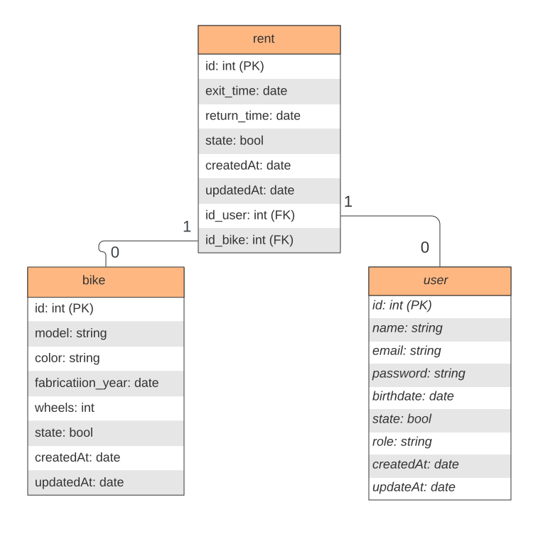

Proficiência DAW2 - Lindovaldo (05/04/2023)

O projeto foi desenvolvido com o intuito de ser submetido a avaliação de proficiência da disciplina de Desenvolvimento de Aplicações Web II (DAW II), ministrada pela professora Lídia Bononi.

O sistema tem o objetivo de informatizar um sistema de locação de bicicletas onde o ciclista consegue ver suas bikes que já foram locadas e os administradores conseguem criar locações de bikes e adicionar novos modelos de bicicletas, assim como adicionar novos usuários ao sistema.

Tecnologias usadas no desenvolvimento back-end:	

	nodejs
	express
    sequelize
	body-parse
	bcrypt
	cors    
    mysql	

Tecnologias usadas no desenvolvimento front-end:	

	angular
	angular material
	momentjs

[Alugue Bikes Front](https://github.com/lindovaldo1/aluguel-bike-front/tree/master)
[Alugue Bikes Back](https://github.com/lindovaldo1/aluguel-bike)
